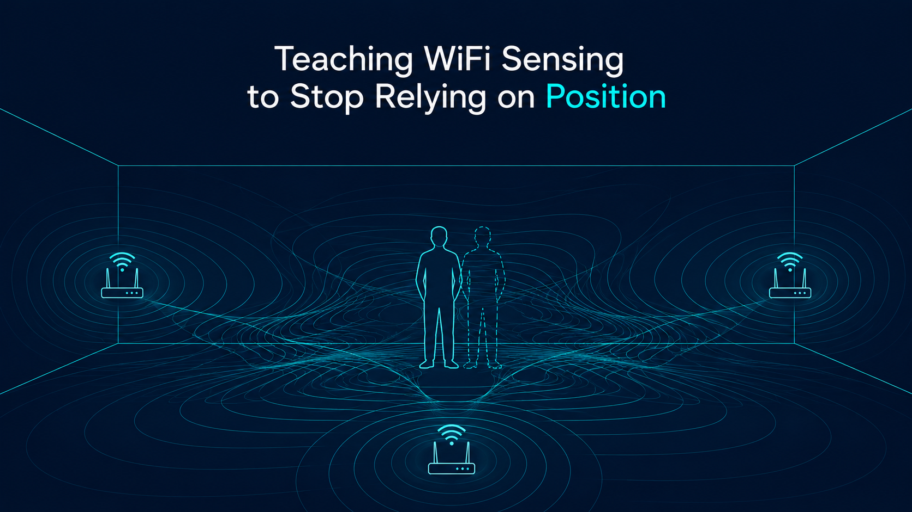

# PIPE: Teaching WiFi Sensing to ignore position



### This codebase is part of the BSc Thesis 'PIPE: Teaching WiFi Sensing to ignore position' by Kenzo Heijman (k.e.heijman@student.tudelft.nl)

The full thesis is available here: [PIPE-thesis.pdf](PIPE-thesis.pdf)

PIPE is a contrastive learning pipeline for WiFi-based human activity recognition (HAR). It trains a CSI encoder supervised by motion-capture body pose, then trains a lightweight activity classifier on top of the learned embeddings. This repository contains the full pipeline and all scripts needed to reproduce the paper's experiments.

## Poster


---

## Requirements

- Python 3.10 or newer
- [uv](https://github.com/astral-sh/uv) for dependency management (`pip install uv`)
- **A CUDA-capable GPU.** Training the encoder and classifier on CPU is not feasible.
- **At least 1 TB of fast SSD/NVMe storage.** The preprocessed cache is large (50–280 GB per window size, see Section 6.3 below), and you need room for the raw dataset plus the cache at the same time. A slow HDD will bottleneck the data loader badly.

Install dependencies:

```bash
uv sync
```

---

## Dataset layout

The pipeline expects two separate dataset directories.

**Training data** (`data.datasets_dir` in `config.yaml`, default `../datasets/`):

Each recording is a subdirectory containing four parquet files:

```
datasets/
  rec00/
    csi.parquet        # raw CSI amplitude and phase per packet
    meta.parquet       # receiver metadata (timestamps, frame spacing)
    markers.parquet    # motion-capture marker positions per frame
    labels.parquet     # activity label intervals (start/stop in microseconds)
  rec01/
    ...
```

**Test data** (`data.test_datasets_dir` in `config.yaml`, default `../datasets_test/`):

Used only for zero-shot transfer evaluation (no motion capture needed). Each session is a directory named `session_<N>_<activity>_<location>` containing the CSI parquet files:

```
datasets_test/
  session_01_walk_middle/
    csi.parquet
    meta.parquet
  session_02_walk_edge/
    ...
```

Valid locations are `middle`, `edge`, `outside`. Activity names must match the labels in `src/data.py`.

---

## Configuration

Open `config.yaml` and set the paths to your data:

```yaml
data:
  datasets_dir: ../datasets/              # training recordings
  test_datasets_dir: ../datasets_test/    # zero-shot test sessions
  cache_dir: ../cache/                    # where the preprocessed cache is written
```

Everything else can be left at its default for a standard run.

---

## Running the pipeline

### Step 1: Build the data cache

Preprocesses the raw parquet files into a sliding-window cache. Run once; safe to re-run (it skips steps that are already complete).

```bash
uv run python pipeline/prepare.py
```

This takes a while on the first run and writes a cache directory under `cache_dir`.

### Step 2: Train the encoder

Trains the WiFi CSI encoder with contrastive pose supervision.

```bash
uv run python pipeline/train.py
```

Saved to `runs/<date-time>/`:
- `best_model.pt`: checkpoint with the lowest contrastive loss
- `training_log.csv`: loss / embedding std / learning rate per epoch
- `activity_log.csv`: val / holdout HAR accuracy per epoch
- `tsne_NNN.png`: embedding t-SNE snapshots

### Step 3: Evaluate

Runs the full HAR evaluation on the best checkpoint. Prints a summary table and saves `results.json`.

```bash
uv run python pipeline/evaluate.py
```

---

## Reproducing the paper experiments

The experiment scripts are numbered in the order they appear in the paper. Each is idempotent: re-running skips results that already exist.

> **Dependencies between scripts:** Scripts 1–3 and 5 are independent. **Script 4 requires script 3 to have finished first** (it uses the win=50 encoder it produces). Script 2 also reads script 1's output to pick the best preprocessing, but falls back to a default if you skip it.

### Section 6.1: Preprocessing

Compares six within-window CSI normalisation strategies.

```bash
uv run python scripts/1_exp_normalization.py
```

Output: `runs/normalization/results.json`

### Section 6.2: Supervision objectives

Sweeps contrastive loss bandwidths (σ_p, σ_v) across pose / velocity / body-state variants, then compares the best body-state model against direct activity labels (SupCon).

```bash
uv run python scripts/2_exp_supervision.py
```

Output: `runs/supervision/sigma_sweep/results.json`, `runs/supervision/supcon_compare.json`

> Reads `runs/normalization/results.json` for the best preprocessing. Run script 1 first, or it falls back to `whiten`.

### Section 6.3: Window size

Trains encoders for window sizes of 10, 50, 100, and 200 ms and evaluates both in-distribution HAR and zero-shot transfer per location.

```bash
uv run python scripts/3_exp_window_size.py
```

Output: `runs/window_sweep/results.json` (the win=50 encoder under `runs/window_sweep/win50/` is needed by script 4)

> **Disk:** each cache is between 50 and 280 GB depending on window size. The script checks free space before building and skips any window size that would not fit. It builds, uses, then deletes each non-baseline cache before moving on, but make sure you have the headroom for the largest one.

### Section 6.4: Position invariance

Measures the per-activity accuracy gap between in-distribution and zero-shot evaluation, and tests how well room position can be decoded from the encoder embeddings versus raw CSI.

```bash
uv run python scripts/4_exp_position_invariance.py
```

Output: `runs/position_invariance/per_activity_delta.json`, `runs/probe_hip/results.json`

> Requires `runs/window_sweep/win50/` from script 3.

### Section 6.5: SHARP baseline

Trains and evaluates the SHARP amplitude-Doppler CNN baseline on the same split as PIPE, then zero-shot transfers to unseen locations.

```bash
uv run python scripts/5_exp_sharp.py
```

Output: `runs/<timestamp>_sharp_baseline/metrics.json`, `runs/sharp_zeroshot/results.json`

---

#### Claude Code was used to help implement this codebase
